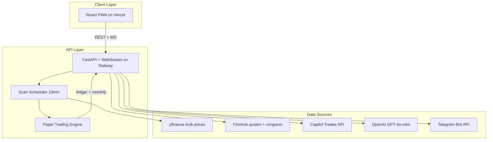
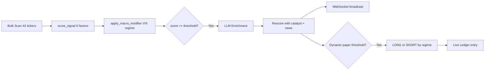
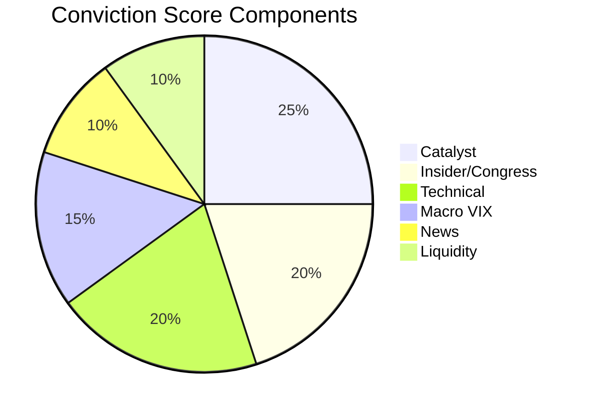

# BigTrades — AI-Powered Market Signal Platform

[](https://python.org)
[](https://fastapi.tiangolo.com)
[](https://react.dev)
[]()
[]()

> **Real-time conviction scoring + congressional intel + LLM enrichment + autonomous paper trading** — built as a full-stack quant research platform, not a charting toy.

---

## What BigTrades Does

- **5 Signal Modes** — Surge, Swing, Position, Hold, Radar — each with distinct scoring weights, hold periods, and exit logic
- **6-Factor Conviction Score** — catalyst, insider, congressional, technical, macro (VIX), liquidity, news (0–100)
- **Congressional Intel** — STOCK Act disclosures merged from Finnhub + Capitol Trades
- **AI Enrichment** — GPT-4o-mini writes catalyst summaries, entry zones, TP/stop targets per signal
- **Live WebSocket Feed** — signals update in the browser without refresh
- **Paper Trading Engine** — $10k virtual capital per mode, live ledger, monthly PnL reports, regime-aware LONG/SHORT
- **Telegram Alerts** — high-conviction signals pushed automatically during market hours

---

## Architecture

### System Overview



### Signal Pipeline



### Scoring Model



---

## How BigTrades Differs from Commercial Platforms

| Platform | What they do | BigTrades advantage |
|---|---|---|
| **TradingView** | Charts + community scripts | Adds congressional STOCK Act intel + structured 6-factor conviction score |
| **Bloomberg Terminal** | Institutional data terminal | Lightweight, open architecture; LLM-written trade thesis per signal |
| **Finviz / Stock Rover** | Screeners + fundamentals | Real-time WebSocket updates + 5 signal modes with autonomous paper tracking |
| **Unusual Whales** | Options flow + congress | Integrated paper trading per mode with monthly learning reports |
| **ChatGPT / Copilot** | Generic market Q&A | Structured quant pipeline — not narrative-only; scores drive every decision |

---

## Quick Start

### Backend (FastAPI)

```bash
cd backend/BigTrades-backend
pip install -r requirements.txt
cp ../.env.example .env   # add API keys
uvicorn main:app --reload --port 8000
```

### Frontend (React + Vite)

```bash
cd frontend/BigTrades-frontend
npm install
$env:VITE_API_URL="http://localhost:8000"   # PowerShell
npm run dev
```

Open `http://localhost:5173`

### Smoke Test

```bash
python scripts/smoke_test.py
```

---

## Environment Variables

| Variable | Required | Purpose |
|---|---|---|
| `OPENAI_API_KEY` | Recommended | LLM enrichment + Signal AI chat |
| `FINNHUB_API_KEY` | Recommended | VIX quote, congressional trades |
| `TELEGRAM_BOT_TOKEN` | Optional | Signal alerts |
| `TELEGRAM_CHAT_ID` | Optional | Alert destination |
| `PAPER_CAPITAL` | Optional | Default `10000` per mode |
| `CORS_ORIGINS` | Production | Vercel frontend URL |

> Never commit `.env` files. Set secrets in Railway (backend) and Vercel (frontend) dashboards.

---

## Paper Trading Philosophy

- **$10,000** virtual capital per signal mode, reset monthly
- **Dynamic thresholds** — bull markets raise the bar; bear markets lower it to stay active
- **Regime-aware direction** — SHORT high-conviction Surge/Swing in `RISK_OFF`; LONG Position/Hold as accumulation plays
- **Live ledger** — every buy, sell, and monthly reset recorded with running balance
- **Monthly lessons** — auto-generated PnL breakdown for continuous strategy improvement

---

## Repository Structure

This monorepo contains both apps. For GitHub publishing, use two repos:

| Repo | Source folder | Deploy |
|---|---|---|
| `BigTrades-backend` | `backend/BigTrades-backend/` | Railway |
| `BigTrades-frontend` | `frontend/BigTrades-frontend/` | Vercel |

Copy this README to both repos. Add a one-line pointer to the sibling repo at the top.

---

## Tech Stack

- **Backend:** Python 3.11, FastAPI, SQLite, yfinance, httpx, OpenAI API
- **Frontend:** React 18, Vite, inline CSS (no framework bloat), PWA service worker
- **Deploy:** Railway (API) + Vercel (SPA) + WebSocket live feed

---

## Product Philosophy — Curated Watchlist

BigTrades scans ~42 curated tickers across 5 tiers (Large, Mid, Small, ETF, Radar) rather than the entire market. This is intentional:

- Conviction history builds over time across sessions
- Paper trading tells a coherent performance story
- API costs stay bounded for a side-project scale

**Roadmap:** dynamic Radar rotation, user-entered discovery scans, LLM monthly narrative reports.

---

*Built by a TPM who ships — demonstrating product thinking, full-stack execution, and quant rigor.*
